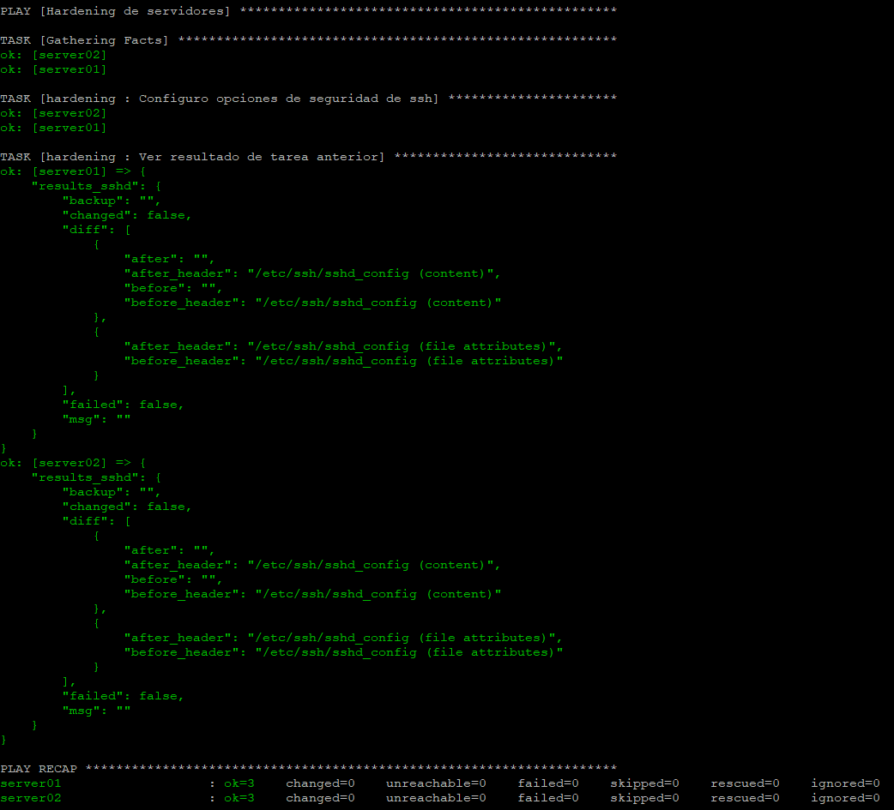
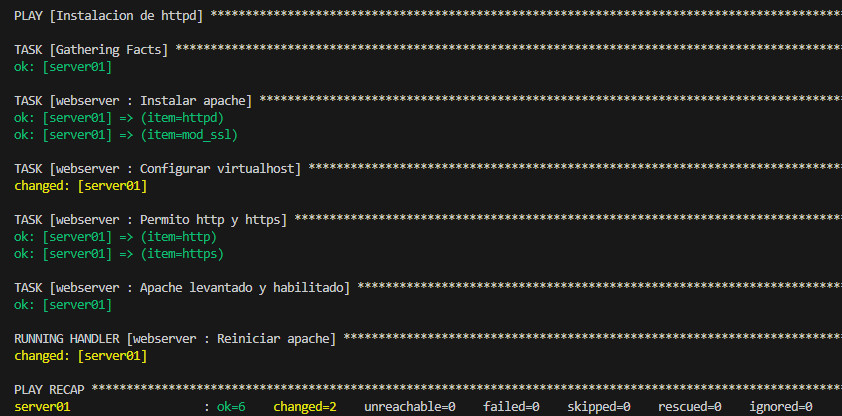

# Obl-TallerLinux

Playbooks de ansible para desplegar app "todo" en tomcat, instalar apache y mariadb

## Instalación

Se instala Ansible y complementos utilizando pipx

```bash
pip install pipx
pipx ensurepath
pipx install ansible-core
pipx inject ansible-core argcomplete
pipx inject ansible-core ansible-lint
activate-global-python-argcomplete --user
```

Se ejecuta .bash_completion con nuestro usuario

```bash
source /home/sysadmin/.bash_completion
```

## Preparación del entorno

Se crean par de claves ssh para poder conectarnos desde nuestro controlador de Ansible hacia los hosts

```bash
ssh-keygen
```

Se copia la clave publica en los hosts

```bash
ssh-copy-id 192.168.50.20
ssh-copy-id 192.168.50.21
```

Se instala git y se clona el repositorio

```bash
sudo dnf install git
git clone git@github.com:AforGaming/Obl-TallerLinux.git
```

Se instalan los modulos necesesarios

```bash
ansible-galaxy collection install -r collections/requirements.yml
```

## Uso

Se ejecutan los playbooks

Hardening de SSH

```bash
ansible-playbook hardening.yml -i inventory/servidores.yml --ask-become-pass
```



WebServer

```bash
ansible-playbook webserver.yml -i inventory/servidores.yml --ask-become-pass
```



BD

```bash
ansible-playbook database.yml -i inventory/servidores.yml --ask-become-pass
```


Tomcat

```bash
ansible-playbook tomcat.yml -i inventory/servidores.yml --ask-become-pass
```


## Licencia

[MIT](https://choosealicense.com/licenses/mit/)